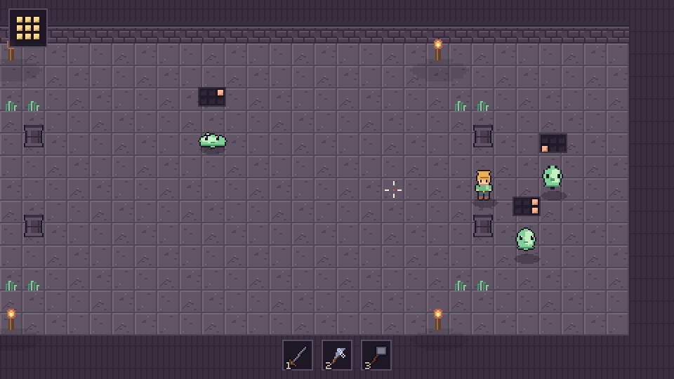

# Gridheart

A top-down pixel-art action roguelite where your health is not a number but a
**shape**, and every weapon carves a different pattern out of it.

> "Oh, this looks like a normal cute action roguelite."
> ... "Wait — the health bar works like Tetris?"

**Play it:** https://mosrvs2025.github.io/gridheart/



## The idea

Every combatant is an ordinary animated pixel-art character in the world, and
*separately* has a 2D grid of health cells. Attacks connect in real time, the
usual way — and then the weapon's geometric pattern is placed on the target's
grid, rotated to the direction of the blow and seated where the blow landed.

So position matters twice over: where you stand in the room, and where that
puts your weapon's shape inside the enemy.

- A **sword** cuts a row of four *along* your swing.
- A **spear** takes a column of four *across* it.
- A **hammer** takes a 2x2 block and smashes plate open.
- An **axe** takes an awkward hooked chunk; a **dagger** takes two cells fast
  and leaves venom creeping; a **bow** takes exactly one cell, at any range.

Strike a wide body from the side and a sword eats four cells. Strike the same
body from above and it only reaches one. Plate that holds a blow stops the rest
of that blow reaching the soft middle behind it, so an armoured knight has to be
opened up before it can be killed.

Your own health grows the same way: after a room you choose one of three growth
shapes, turn it, and attach it to your grid wherever it fits. Over a run you
physically build the body you fight with.

## Controls

Play it with a hand on the mouse or without one; neither is a fallback for the
other, and you can switch mid-fight. The reticle follows whichever you used last.

| | |
|---|---|
| `WASD` | move |
| arrow keys / `IJKL` | aim **and** attack in that direction |
| `F` | attack the way you are already facing |
| mouse | aim |
| left click | attack |
| `space` / `shift` | dodge |
| `1` `2` `3` | weapon slots |
| `tab` / `Q` | next weapon |
| `E` / `enter` | interact, confirm |
| `R` | turn a shape while placing it |
| `WASD` / arrows | move the shape while placing it |
| `esc` | decline a mend |

With no mouse at all the aim falls back to the way you are walking, so `F` always
swings forward.

## The run

The Threshold → five fights → the Quiet Sanctum (mend your grid, take a new
weapon) → the Throne. Roughly five to ten minutes. Enemies are a slime, a
goblin, an archer and an armoured knight, each with a different health layout,
and the Hollow Sovereign at the end, whose armoured flanks and plated core
change how it fights as they come apart.

## Building it

Godot 4.3, GDScript, no addons. Everything in `assets/` is generated by the
scripts in `art/` — the sprites are drawn pixel by pixel in Python and the
sound effects are synthesised, so there are no binary assets without a source.

```bash
# regenerate the art and sound
cd art && python3 build.py && python3 make_sfx.py

# run the tests (pure logic, then real nodes in a scene tree)
godot --headless --script tests/test_core.gd
godot --headless tests/integration.tscn

# run a whole run, start to finish, in one headless pass
godot --headless tests/run.tscn

# export the web build into docs/, which is what GitHub Pages serves
tools/export_web.sh
```

The web export is the single-threaded variant on purpose: GitHub Pages cannot
send the `COOP`/`COEP` headers that Godot's threaded export needs.

Append `?room=6` to the page URL to start in a later room, and `&god=1` to stop
taking damage — useful when working on the boss.

## Layout

```
art/         python that draws every sprite and synthesises every sound
assets/      the generated result, plus the two OFL pixel fonts
scenes/      player, weapons, ui
scripts/
  health_grid/   the grid itself, its cells, and the view that draws it
  combat/        weapon data, and the resolver that places a pattern on a grid
  enemies/       enemy behaviour, enemy data, the boss
  systems/       rooms, room building, art and audio loading, the run
tests/       headless checks for the grid, the resolver and the whole chain
docs/        the exported web build served by GitHub Pages
```

The health grid is deliberately pure data — it knows nothing about sprites, and
the character knows nothing about the shape of its health.

## Credits

Fonts: [Silkscreen](https://fonts.google.com/specimen/Silkscreen) and
[Press Start 2P](https://fonts.google.com/specimen/Press+Start+2P), both under
the SIL Open Font License. Everything else is generated by this repository.
